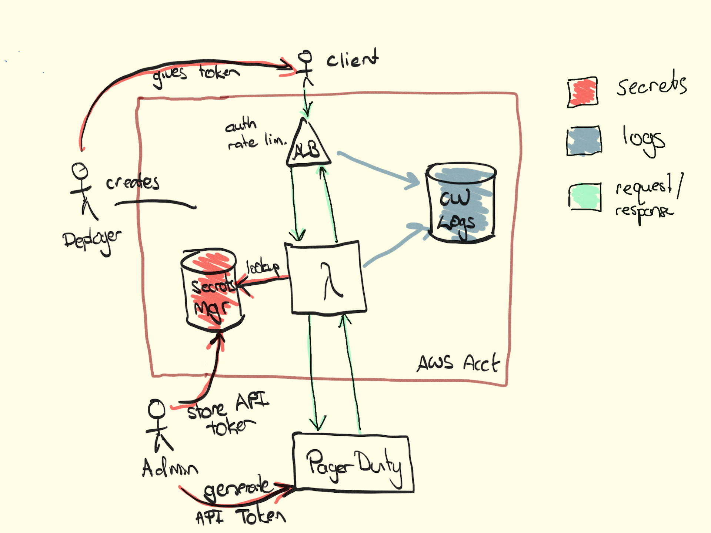

# Who's on call?

Simple authenticated (JSON) API that returns current on-call person for given PagerDuty schedule.

We want to be able to programatically identify the on-call person for a schedule. However PagerDuty API keys have [access to all APIs](https://v2.developer.pagerduty.com/docs/authentication):
> access to all of the data on an account, and can either be granted read-only access or full access to read, write, update, and delete

... and we only want to expose the on-call schedule 😕

Once deployed, the API can be invoked thus:

    curl -H 'x-api-key: secret' https://endpoint/dev/whos-on-call\?schedule\=P538IZH

Will return a JSON object like:

    {"name":"Audrey Satterfield","email":"audrey.satterfield@example.com"}

if there's a problem (e.g. incorrect schedule) you'll get something like:

    {"error":"Unable to determine on-call person"}

API keys are generated automatically and displayed on deployment.

## Deploying into development

This project uses the [Serverless Framework](http://serverless.org) to deploy an ELB, golang-based
Lambda function that acts as a secure proxy for retrieving the on-call person for a schedule.



Requires golang 1.12.8+ build environment, serverless framework and serverless-pseudo-parameters plugin.

If you're on a mac:

    brew install golang
    npm install -g serverless
    npm install serverless-pseudo-parameters

then, to deploy dev instance:

    assume-role orionhealth
    make deploy

to modify API keys or the secret name, edit `config.dev.json`. The reference config looks like
the following:

````json
{
  "secret-name": "whosoncall-2u3WKD",
  "api-keys": [
    "test-client1-20190901",
    "test-client2-20210301"
  ]
}
````

This configures:

* a lookup for an AWS Secrets Manager secret called `/dev/whosoncall-2u3WKD`. It must be in the same AWS region/account.
* provisions two API keys for use by clients. These are displayed on a successful "make deploy"


## Key rotation

Client API keys can be rotated by replacing keys in the "api-keys" config stanza. Ideally
keys will be formatted with creation date so it's easy to (a) know a key needs rotating, and (b) trigger a rotation by updating the date stamp.

The PagerDuty API key can be rotated by updating the value stored in AWS Secrets Manager directly. It's
cached by the Lambda for only a short period (90s) so any updates should be picked up quickly.
